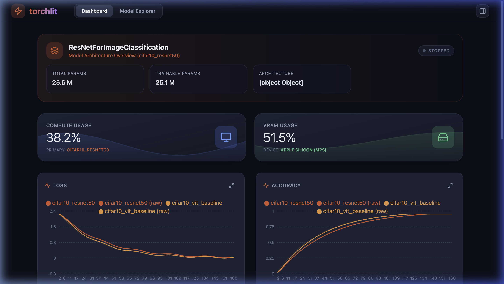

# torchlit 🔥

<p align="center">
  <a href="https://pypi.org/project/torchlit-lib/">
    
  </a>
  
  
  <a href="https://github.com/ChanLumerico/torchlit/stargazers">
    
  </a>
  <a href="https://github.com/ChanLumerico/torchlit/network/members">
    
  </a>
</p>

<p align="center">
  <b>A lightweight, beautiful, and interactive real-time PyTorch training dashboard.</b>
</p>

<p align="center">
  
</p>

---

`torchlit` is a zero-setup desktop GUI that hooks directly into your PyTorch training loops to monitor metrics, system stats, and model architecture in real time. Stop relying on cluttered TQDM bars or heavy logging frameworks.

## ✨ Features

- **Zero Configuration** — `with torchlit.Monitor():` and your dashboard spins up instantly
- **Real-Time Streaming** — FastAPI + WebSockets push metrics to the browser immediately
- **Model Architecture Explorer** — Interactive, color-coded layer tree with parameter counts
- **Multi-Session Comparison** — Overlay and compare multiple experiments side-by-side
- **Rust CLI Progress Display** — Beautiful terminal TUI (powered by `ratatui`) while training runs
- **System Resource Sparklines** — Live CPU, RAM, and VRAM usage tracking
- **CSV Export** — Download all aggregated metrics at any time
- **Auto-Shutdown** — Background server cleans up automatically when the browser is closed

## 🚀 Quick Start

```bash
pip install torchlit
```

```python
import torch
import torchlit

model = torch.nn.Sequential(
    torch.nn.Linear(10, 50),
    torch.nn.ReLU(),
    torch.nn.Linear(50, 2)
)

with torchlit.Monitor(exp_name="my_experiment", model=model, total_steps=100) as logger:
    for step in range(1, 101):
        loss = max(0, 1.0 - step * 0.01)
        logger.log({"loss": loss, "accuracy": step / 100.0}, step=step)
```

*Your browser opens automatically at `http://localhost:8000`.*  
*A live Rust-powered TUI also appears directly in your terminal.*

## 📖 Full Example

See [`examples/example.py`](examples/example.py) for a complete CIFAR-10 + ResNet-50 training loop demonstrating all features.

```bash
python examples/example.py
```

## ⚙️ Monitor Options

| Parameter | Type | Default | Description |
|---|---|---|---|
| `exp_name` | `str` | `"default_experiment"` | Name for this training run |
| `model` | `nn.Module` | `None` | PyTorch model (for architecture extraction) |
| `total_steps` | `int` | `None` | Total steps (enables ETA in CLI display) |
| `server_url` | `str` | `http://localhost:8000` | Dashboard server URL |
| `flush_interval` | `float` | `1.0` | Seconds between network flushes |

## 🏗️ Architecture

```
torchlit.Monitor  ──►  FastAPI Backend  ──►  React Dashboard (browser)
      │                                             │
      └──►  Rust CLI (torchlit-progress)            └──►  WebSocket streaming
```

## 📦 Platform Support

`pip install torchlit` includes pre-compiled CLI binaries for all major platforms:

| Platform | Binary |
|---|---|
| macOS ARM (M1/M2/M3) | ✅ Included |
| macOS Intel | ✅ Included |
| Linux x86_64 | ✅ Included |
| Windows x64 | ✅ Included |

## 🔗 Links

- [GitHub](https://github.com/ChanLumerico/torchlit)
- [PyPI](https://pypi.org/project/torchlit/)
